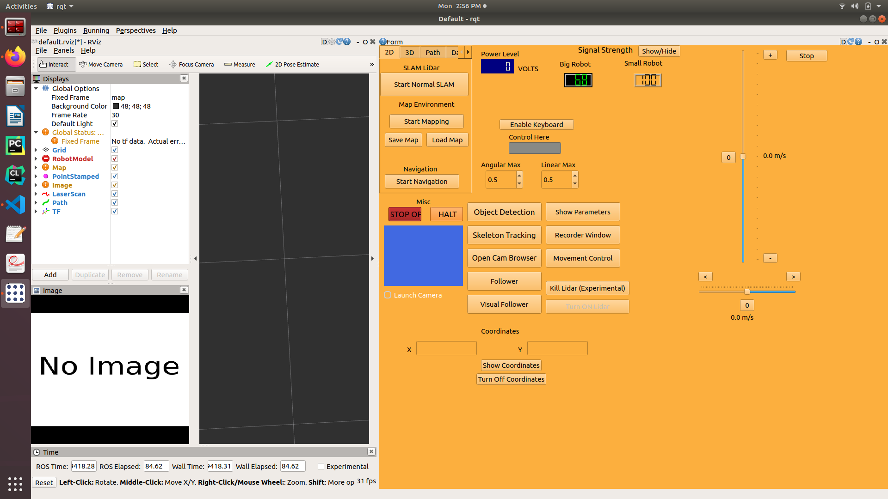

# Architecture
## 2D mapping

For more detail on the sensors are used, view [2d-slam-sensors.md](docs/2d-slam-sensors.md).

# UI
## Start UI
Before starting the UI please ensure that the WheelTec robot is powered on and the operator PC
is connected to the wheeltec robot's WIFI hotspot. 
\
\
If commiuncation with the WheelTec robot fails
an error will appear telling the operator that it failed to connect to "ROS Master".
\
\
You can run the UI either by searching for "ROBOT-CONTROL" in the application search bar.
Or by running the icon on the desktop.

The UI for controlling the robot should look something like the following below.

## UI Use
The main operation control UI is the component on the right. There are currently three states of operation within the UI: Manual teleop, Mapping and 
Navigation. Each of them can only be run while the robot is in its idle state. (not currently in 
any of the three state of operations)
\
\
Currently the UI only allows for control using 2D mapping and navigation.

### Manual teleop control
Allowing for manual robot control through UI. W, S, A, D keys can be used for driving.

### Mapping
Maps the environment around the robot while the operator manually controls it.

### Save map
Can only be used while the robot is mapping. Saves the current map built of the environment, 
overwriting pre-existing map.

### Navigation
Loads saved map, localizes robot within map and allows for autonomous transversal. The 2D nav goal tool
in the middle window can be used to place a goal for the robot to attempt navigation towards.

### Stop Operations
Stops current operation. (Manual teleop, Mapping, Navigation)

### Status Display
On the very bottom is the status display.

# Manual use without UI
## Autonomious navigation
### 2D Mapping with lidar
#### Mapping
- `roslaunch turn_on_wheeltec_robot mapping.launch`

#### Navigation
- `roslaunch turn_on_wheeltec_robot navigation.launch`

### 3D Mapping with lidar and depth camera
#### Mappping
- ''

#### Navigation
- ''

### General
### Save map during mapping
In a separate terminal session than where mapping is running
- `roslaunch turn_on_wheeltec_robot map_saver.launch`

### Manual teleop via keyboard
In two separate terminal sessions:
- `roslaunch turn_on_wheeltec_robot turn_on_wheeltec_robot.launch`
- `rosrun teleop_twist_keyboard teleop_twist_keyboard.py`
