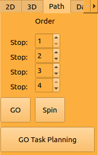

# 1. Architecture

## 1.1 2D mapping ROS graph

Fig. 1: ROS Node Tree

## 1.2 Sensors Feedback Usage

### 1.2.1 Wheel Odometry

Wheel odometry is published to /odom from the Wheeltec robot.

Wheel odometry is a method of estimating the movement of a mobile robot by measuring the rotations of its wheels.
It works by using sensors, such as encoders or tachometers, to measure the rotations of the robot's wheels and then
using this information to calculate the distance and direction that the robot has moved.

It is also prone to errors and drift over time, so it must be used in combination with other sensors and algorithms to
provide accurate pose estimates.

### 1.2.2 IMU

IMU type: WHEELTEC N100 IMU Module w/ Metal Shell 9-Axis Attitude Sensor Magnetometer USB Serial Port Output

There is an IMU (inertial measurement unit) built in the Wheeltec robot and it is published to /imu on the small robot and /imu_raw on the big robot.
As an initial idea, we can use the imu topic to figure out the rate of change of the acceleration,
this helps us detect sudden decelerations, which indicate the possibility of a collision.
A new node named monitors keeps track of the current and previous accelerations,
and uses them to find the rate of change.
This node is written in C++ and allows the rover to stop in case of collisions for both autonomous driving and manual controls.

IMU and wheel odometry are often used together in order to provide accurate pose estimates
for a mobile robot. An IMU is a sensor that measures the linear and angular accelerations of a moving body, using a
combination of accelerometers and gyroscopes. It can be used to estimate the robot's orientation
and linear velocity, but it is subject to errors and drift over time.

To combine the measurements from an IMU and wheel odometry, a sensor fusion algorithm is used. The sensor fusion algorithm
used here is a Kalman filter.

[Kalman filters](https://en.wikipedia.org/wiki/Kalman_filter) use the measurements from each sensor as well as a model of the robot's dynamics to predict the robot's
pose, and then it updates the prediction based on the new measurements as they arrive.

### 1.2.3 LiDAR

A LIDAR (light detection and ranging), uses a laser light to measure distances to objects and create detailed 2D or 3D maps of the surrounding environment and to estimate its own pose.
The LiDAR installed on the small Wheeltec robot is the result of a cooperation between Wheeltec and LSLiDAR. It is part of the
N10 series, a high-performance single-line mechanical TOF LiDAR. Which means it is only capable of 2D mapping on its own.
Its output is published to /scan.
On the Big Robot we are using the LSLIDAR C16 by Leishen Intellignet System which can create a 3D point cloud (not only 2D).

To use the lidar in our project we will be using the package that will turn on the lidar and the AMCL package. The AMCL, known as the adaptive monte carlo localization, is a commonly used algorithm for estimating a robot's position and orientation (pose) within its environment. It's a probabilistic localization algorithm that uses a particle filter to represent the robot's possible poses and updates these poses based on sensor measurements. When using a LiDAR sensor with AMCL in ROS1, the primary goal is to improve the accuracy of the robot's localization by integrating the LiDAR's data into the estimation process.

The Lidar has already hard coded values for the minimum and maximum angle and range to scan. We can change these values by first connecting to the robot via SSH and on the robot we can go to this directory "/home/wheeltec/wheeltec_lidar/src/pointcloud_to_lasescan/launch" and edit the "pointcloud_scan.launch" file. The parameters are well shown. (Note that the angles are in radian and not degree)

### 1.2.4 Stereo Camera

The stereo camera installed on the Wheeltec robot is the ASTRA PRO. It has two cameras.

Field of View at 58.4° Horizontal and 45.5° Vertical

The RGB Camera: Used for object detection, skeleton detection, visual follower and coloring the 3D map that we want to build.
The Infrared Camera (depth camera): Used with the Lidar for collision avoidance and building a 3D pointcloud map.

An algorithm is used to translate the images captured from the RGB and depth camera into maps, and a 3d map (Point Cloud data) that can be saved and later looked at or instantaneously rendered to the GUI. When stereo camera navigation is enabeled, the rover uses an algorithm known as RTABMAP (Real-Time Appearance-Based Mapping) for trajectory estimation.

To achieve the 3D scan: run the rrt_slam.launch and the rtabmap_mapping.launch or rtabmap_nav.launch files then start moving the robot really slowly for it to scan. After stopping the files from running a database file will be generated on the robot so we can secure copy the file to the lab pc and use the command "rtabmap-databaseViewer <name_of_file.db>"
Now to view the 3D map: Press "Edit" on the top bar then "View 3D map". Select "4" and hit "OK".

The camera has a built in launch file which allows us to publish infrared, depth, and RGB images to the /camera namespace
Running turn_on_wheeltec_rover wheeltec_camera.launch file will initiate the camera node with the needed parameters (30fps, 720x480).

The camera can be used for object detection and skeleton tracking. Usin the "darknet" and "bodyreader" package.
We can use "raw" or "compressed" data for the camera. Compressed is always better to have really low delay.

# 2. Lab PC Info

## 2.1 Networking

The laptop is fitted with two external USB WIFI adapter. Both can be used simultaneously. With one connected to the big robot and the other connected to the smaller robot.
Recommended: Wifi adapter "wlx0c9d92b71f61" (ASUS) connected to the smaller robot and "wlx642943a66a33" (D-Link) to the bigger robot.
Tip: To know the name of the wifi adapter just run the command "iwconfig"

### 2.1.1 Troubleshooting Internet Issues With Dual Adapter Setup

Sometimes on wake or startup of the PC it fails to connect to the internet. If this happens it is likely due to an issue with the
networking route table. Where it's attempting to route DNS connections through connection to the Wheeltec robot instead of the
Concordia University WIFI network. This can be confirmed by using the `sudo route` command and seeing if the gateway of the default
destination is "wheeltec" or "192.168.0.100".

If this happens, simply run the following command: `sudo route del default`.

This should remove the incorrect routing being used and make the PC use the proper one instead.

For some reason, the rover sometimes reassigns the adapter's IP address by incrementing it, when that happens all comms fail between the rover and the lab computer as the IP is statically set beforehand. In this case, it is good to check what the new IP is by running `ifconfig` on the lab PC, and checking the IP address of the external adapter and updating the IP address of concordia lab PC on the rover found in `/etc/hosts`. It is possible to create a script that will ping the old IP address, and if that address fails, updates it.

### 2.1.2 External Adapter Info

The vendor and project IDs for the external USB WIFI adapter are 0b05 184c respectively. This adapter is an
ASUSTek Computer 802.11ac NIC.

The driver installed for the device to be functional on Ubuntu 18.04 was an updated driver for rtl88x2bu. Which can be found
[here](https://github.com/cilynx/rtl88x2bu). It was installed using the deploy.sh script localed in the repository.

The second wifi adapter is a D-Link wifi adapter and its drivers are already installed. 
PLEASE NOTE: To use the D-Link wifi adapter you should open windows OS first from the boot menu of the lab pc and then restart from windows directly to ubuntu.

# 3. Wheeltec Robot Info

## 3.1 Basic Use

You can remotely access both robots terminal shell session using the following command:

-   `ssh wheeltec@wheeltec1` (for the small robot)The first "wheeltec" is the username, the second one is the hostname for 192.168.1.101.
    'ssh wheeltec' (for the small robot)
    Sudo and login password is: 'dongguan'
    To remotely update the UI and other in house packages on board you can use:
-   `scp -r ~/catkin_ws/src/wheeltec-building-inspection/ wheeltec@wheeltec1:catkin_workspace/src/`
    Then its ROS software can be restarted using:
-   `sudo systemctl restart robot_handler.service`
    Then part of its console output and status can be checked using:
-   `sudo systemctl status robot_handler.service`

    There is currently no setup for the robot to have its own internet access.

## 3.2 Battery Info

Battery level for the smaller robot should not go too much below ~10.5V and for the big robot not below 20.5V. Robot will beep as a warning if its battery level is starting to get
low and should be placed on charge.

NOTE: DO NOT KEEP ROBOTS POWERED WHILE ON CHARGE. THIS IS NOT HEALTHY FOR THE BATTERY AND WILL SIGNIFICANTLY DEGRADE ITS
LIFESPAN.

Power info and other telemetry info can be read off of the robot's small LED display as shown in the image below:

Fig. 2: Rover LED display

# 4. UI

## 4.1 Start UI

Before starting the UI please ensure that the WheelTec robot is powered on and the operator PC
is connected to the wheeltec robot's WIFI hotspot.

If commiuncation with the WheelTec robot fails
an error will appear telling the operator that it failed to connect to "ROS Master".

You can run the UI either by searching for "ROBOT-CONTROL" in the application search bar.
Or by running the icon on the desktop.

Fig. 3: GUI Launch Icon

The UI for controlling the robot should look something like the following below.

Fig. 4: User Interface

If it doesn't have all or none of the components on the screen, it may because you need to load the perspective for it in [RQT](http://wiki.ros.org/rqt).
You can do this by selecting the "Perspectives" option on the top and selecting the "wheeltec" option.
If this also fails, you would have to load the components manually, by clicking on "Plugins"->"Visualization"->"RViz" and "Plugins"->"Rover Controller".

## 4.2 UI Use

## UI Use

The UI uses RQT. The main operation control UI is the component on the right.

1: Start SLAM  
2: Start Mapping  
3: Save the Map after doing SLAM 
4 and 5: Load map and start navigation 
6: Stop all nodes. Meaning it will kill all the navigation nodes. 
7: Stop moving the robot. Meaning that when the robot is following a path, the Halt button will stop the robot mid-path 
8: Logs showing when a node is starting or being killed. 
9: Start Stereo Camera node (RGB and Infrared). 
10: Show Power Level. 
11: Show Signal Strength. For the D-link wifi adapter the signal strength should always be between 35 and 100 but for the ASUS wifi adapter the signal strength will be between -30 and -90  
12: Control the robot (press on "Enable Keyboard before controling the robot") 
13: change the speed of the robot (Linear in meters/second and Angular in radian/second) 
14: Turn on Object detection window. We can check the status of the node and see the object detected in a list. 

15: Turn on Skeleton Tracking window. We can record the video and the data coming from the skeleton tracking package. 

16: Start the browser and watch the camera feed through the browser. When this node is running, we can connect to the robot using any device that has a browser and look at the camera feed. NOTE: turn on camera before running the Cam browser. 
17: Experimental button for multi robot communication 
18: Robot will follow anything red in front of the camera. NOTE: turn off the navigation nodes before running the visual follower. 
19: Show and edit the parameters. Note: Sometimes changing the parameters will not affect the robot because some parameters should be changed dynamically. To change parameters dynamically we can run "rosrun rqt_reconfigure rqt_reconfigure" and change them. 

20: Window to Record for now the IMU, Lidar and object detection data. (Check in the Data Capture section) 
21: Window to make the robot holonomic. In this window to make the robot holonomic we have to press the "Activate Holonomic Movement". This button will dynamically change 3 parameters: the max_velocity and the max_acceleration on the y axis (default is 0.5 m/s and m/s^2) and the weight_kinematics_nh. The checkbox "Overwrite Orientation" if it is checked it means that the robot will only move forward, if not it can move forward and backward. 
  
22: Turn off the Lidar node. 
23: Turn on the Lidar node. 
24: Start the coordinates_show node. 
25: Turn off the coordinates_show node 

This is the Path tab where we can give 4 points to the robot and it will follow the path given.

### 4.2.1 Robot Visualization

The middle window seen in the above screenshot is a program called RViz that is usually prepackaged with ROS. It is used
for visualizing robots and data surrounding them.

### 4.2.2 Control Tab

#### Manual teleop control

Manual robot control is allowed in any operation mode through UI. W, S, A, D, and spacebar keys can be used for driving as follows:

First press on the "Enable Keyboard" button and select the "Control Here" entry. Now you can Control the robot using:

-   W - Drive forwards
-   S - Drive backwards
-   A - Rotate to left
-   D - Rotate to right
-   E - Drive to the right
-   Q - Drive to the left
-   p - Halt movement
-   Spacebar - Kill current operation and stop movement (Only for the slider)

RViz also allows placing 2d goals from the UI, this can be done by clicking the "2d Nav Goal" button in the top middle of the UI and then clicking on any part of the map. Also for multi-point navigation we can use the Publish Point button and select several destinations for the robot.

The rover has three different operation types which the operator can start using the UI:

1. SLAM

[SLAM](https://en.wikipedia.org/wiki/Simultaneous_localization_and_mapping) is short for Simultaneous Localization and Mapping, this is the algorithm used with the data received from the Lidar to be able to navigate the 2d map created. Slam allows both goal setting and map creation at the same time. This allows the operator to control the environment, while at the environment and set goals for the rover to navigate to within that map.

2. Mapping

Mapping mode turns on the rover's Lidar and allows creating a map of the environment, however autonomous goal navigation is not possible in this mode unlike SLAM. The UI includes a button labeled "Save map", this button can only be used when the rover is in mapping mode, and allows the operator to save the current map as a ROSBag file.

3. Navigation

Navigation mode loads the saved map, it then localizes robot within that map and allows for autonomous transversal. Any new obstacles added to the map that were not there during the mapping phase will not be acknowledged by the rover.

### 4.2.3 Data Capture Tab

Fig. 5: Data Capture Tab

All captures are stored on the laptop in the '/home/concordia/catkin_ws/src/wheeltec-building-inspection/data_recordings' directory
You can just select the number of seconds you want to record and press a button to start recording.

These are examples of the data type of every sensor:

Lidar: X: -0.01, Y: 1.47, Z: -0.23
       X: -0.01, Y: 1.98, Z: 0.24

IMU: Timestamp: 1666160868481861048, Orientation (x, y, z, w): 0.0062186983414, -0.00795513577759, 0.783027589321, 0.61918926239, Angular velocity (x, y, z):    -0.0218480806798, 0.0143877603114, -0.0796655640006, Linear acceleration (x, y, z): 0.258397936821, 0.521580994129, 9.58225727081

Object Detection: Detected: person at 2023-08-14 11:28:52 at X: 126, Y: 147 with confidence 0.3162766397
                  Detected: person at 2023-08-14 11:28:52 at X: 128, Y: 146 with confidence 0.35608240962
                  Detected: person at 2023-08-14 11:28:52 at X: 123, Y: 151 with confidence 0.30072581768

### 4.2.4 General Control

#### Stop Operations

This kills the current operation (SLAM, RTABMAP, Mapping, Navigation) and sets the rover to Idle mode, until another operation is started. This button should be used when switching from one operation to another.

#### Halt Movement

This button publishes the halt command to the rover, which stops the rover in its place.

# 5. Manual use without UI (For development)
# This file will specify all the built-in capailities on the robot [click here](./Important%20Notes.txt)

## 5.1 Autonomous navigation

### 5.1.1 2D Mapping with lidar

#### Mapping

-   `roslaunch turn_on_wheeltec_robot mapping.launch`

#### Navigation

-   `roslaunch turn_on_wheeltec_robot navigation.launch`

### 5.1.2 3D Mapping with depth camera

#### Mappping

-   `roslaunch turn_on_wheeltec_robot pure3d_mapping.launch`

#### Navigation

-   `roslaunch turn_on_wheeltec_robot pure3d_navigation.launch`

### 5.1.3 3D Mapping with depth camera and lidar

#### Mapping

-   `roslaunch turn_on_wheeltec_robot 3d_mapping.launch`

#### Navigation

-   `roslaunch turn_on_wheeltec_robot 3d_navigation.launch`

### 5.1.4 General

#### Save map during mapping

In a separate terminal session than where mapping is running

-   `roslaunch turn_on_wheeltec_robot map_saver.launch`

#### Manual teleop via keyboard

In two separate terminal sessions:

-   `roslaunch turn_on_wheeltec_robot turn_on_wheeltec_robot.launch`
-   `rosrun teleop_twist_keyboard teleop_twist_keyboard.py`

# 6. Safety Measures

## 6.1 Collision Avoidance

Using the Lidar and Depth Camera the robot is able to avoid obstacles

## 6.2 Virtual Fence

When saving a new map, we can manually add obstacle to the map saved using a picture editor like GIMP. We use the black color to add obstacles.

## 6.3 Collision Detection

Using the IMU we can detect when a collision happens.

## 6.4 Physical Red Buttons

There are two emergency buttons on the robot. The hardware button will cut the electricity running in the robot. The software button will stop the operating system from running.
The Hardware emergancy stop button is the closest button to the charging port. And the other button is the Software emergancy stop button.

## 6.5 Signal

When the connection signal between the robot and the laptop is weak the robot will stop from moving until we fix the connection.

## 6.6 Max Speed Limit

The max speed limit is set to 0.5 meters per second and can be changed on the UI.

# 7. Development tips

## 7.1 What runs where?

The UI package under the repo contains packages that hold the nodes for the UI that runs on the lab PC and robot itself.

### Running on the lab PC

-   building-inspec.py

### Running on the robot

-   RobotHandler.py
-   cpp_monitor.cpp

### UI communication with robot

The following three topics are currently used for sending information such as statuses, file lists and commands between the robot
and UI respectively.

-   /robot_handler_status - string message formatted with space character as delimiter between command and arguments
-   /file_cap_list - string message formatted with character '|' used as delimiter between file names
-   /robot_handler_cmd - string message

## 7.2 UI startup via terminal

You can run the UI on its own by running `roscore` in its own terminal session then run the following:

-   `rqt --standalone wheeltec-building-inspection-ui`

To run the full RQT layout that communicates with the robot with console output for troubleshooting, you can run the following
in root directory of project:

-   `bash UI/ui-startup/run_rqt_gui.sh`

## 7.3 Building and running packages in this repo

There is a requirements.txt file that lists all the known python requirements for these packages to run.
It is recommended to create a python virtual environment in the root of this project, install the required
packages and set up the python project with the following:

-   `python -m venv venv` in root directory of project
-   `source venv/bin/activate`
-   `pip install -r requirements.txt`
-   `pip install -r UI/requirements.txt`
-   `python setup.py develop`

NOTE: Due to odd behaviour with how the python interpreter loads modules,
the following had to be added to `~/.bashrc`:

-   `export PYTHONPATH=$PYTHONPATH:/home/$USER/catkin_ws/src/wheeltec-building-inspection`

This is more of a workaround for import errors as it is manually adding this project's root path
to the python path environment variable, but it does allow all the modules here to be loaded properly.

# 8. Research goals and ideas

The long term goal of this project is to develop a fleet of autonomous robots capable of helping perform building
inspection with the use of its sensors on board. Using the Lidar and Stereo camera in order to map the environment it
navigates; the environment being the building that engineers wish to inspect.

Our current short term goal is to upgrade the rover's operating system as well as the version of ROS to ROS2.

So far the work that has been done is the UI that makes it possible to capture the data from the Lidar during the operation
of the robot. This data currently being captured is of a series of [sensor_msgs/LaserScan](http://docs.ros.org/en/noetic/api/sensor_msgs/html/msg/LaserScan.html)
ROS messages in the file format of bag files. The set of tools used for data capture is the ROSBAG which can be found [here](http://wiki.ros.org/rosbag) in extensive detail.

The UI can be updated to additionally capture data from the stereo camera as well. If data is recorded with the message format of
[sensor_msgs/PointCloud](http://docs.ros.org/en/melodic/api/sensor_msgs/html/msg/PointCloud.html), it can be converted to a PCD format file
using the following command: `rosrun pcl_ros bag_to_pcd <input_file.bag> <topic> <output_directory>` as detailed [here](http://wiki.ros.org/pcl_ros).

PCD files are a standard format that are used with the Point Cloud Library and there are many tools available that can be used
to analyze and display them. More details about this format can be found on the [official point cloud website](https://pointclouds.org/documentation/tutorials/pcd_file_format.html).
