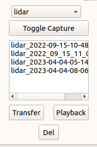

# 1. Architecture

## 1.1 2D mapping ROS graph

Fig. 1: ROS Node Tree

## 1.2 Sensors Feedback Usage

### 1.2.1 Wheel Odometry

Wheel odometry is published to /odom from the Wheeltec robot.

Wheel odometry is a method of estimating the movement of a mobile robot by measuring the rotations of its wheels.
It works by using sensors, such as encoders or tachometers, to measure the rotations of the robot's wheels and then
using this information to calculate the distance and direction that the robot has moved.

it is also prone to errors and drift over time, so it must be used in combination with other sensors and algorithms to
provide accurate pose estimates.

### 1.2.2 IMU

There is an IMU built in the Wheeltec robot and it is published to /imu .
As an initial idea, we can use the imu topic to figure out the rate of change of the acceleration,
this helps us detect sudden decelerations, which indicate the possibility of a collision.
A new node named acceleration_monitor keeps track of the current and previous accelerations,
and uses them to find the rate of change.
This node is used in collision detection with manual and SLAM navigation, it stops the rover
in its place when a collision occurs.

IMU (inertial measurement unit) and wheel odometry are often used together in order to provide accurate pose estimates
for a mobile robot. An IMU is a sensor that measures the linear and angular accelerations of a moving body, using a
combination of accelerometers, gyroscopes, and sometimes magnetometers. It can be used to estimate the robot's orientation
and linear velocity, but it is subject to errors and drift over time.

To combine the measurements from an IMU and wheel odometry, a sensor fusion algorithm is used. The sensor fusion algorithm
used here is a Kalman filter.

[Kalman filters](https://en.wikipedia.org/wiki/Kalman_filter) use the measurements from each sensor as well as a model of the robot's dynamics to predict the robot's
pose, and then it updates the prediction based on the new measurements as they arrive.

### 1.2.3 LiDAR

The LiDAR installed on the Wheeltec robot is the result of a cooperation between Wheeltec and LSLiDAR. It is part of the
N10 series, a high-performance single-line mechanical TOF LiDAR. Which means it is only capable of 2D mapping on its own.
Its output is published to /scan.

The LiDAR is used to build a map of its surroundings and estimate its own pose (i.e., its position and orientation)
in the environment.

### 1.2.4 Stereo Camera

The stereo camera installed on the Wheeltec robot is the ASTRA PRO.

The camera captures images of the environemnt, these images contain RGB and depth information about the environment. An algorithm is used to translate this data into maps, a 2d map used for the navigation algorithm, and a 3d map (Point Cloud data) that can be saved and later looked at or instantaneously rendered to the GUI. When stereo camera navigation is enabeled, the rover uses an algorithm known as RTABMAP for trajectory estimation.

The camera has a built in launch file which allows us to publish infrared, depth, and RGB images to the /camera namespace
Running turn_on_wheeltec_rover wheeltec_camera.launch file will initiate the camera node with the needed parameters (30fps, 720x480). In order to run this launch file a small change needs to be made to the astra_camera.launch file and correcting the name of the camera driver's source file from astra_camera to libuvc since the latter is not preinstalled.

The camera launch files are mostly operational, however

# 2. Lab PC Info

## 2.1 Networking

The laptop is fitted with both its internal WIFI network adapter along with an external USB WIFI adapter. Both are used
simultaneously. With the internal adapter connected to the Concordia University network for internet access and the external
being connected to the network hotspot of the Wheeltec robot.

### 2.1.1 Troubleshooting Internet Issues With Dual Adapter Setup

Sometimes on wake or startup of the PC it fails to connect to the internet. If this happens it is likely due to an issue with the
networking route table. Where it's attempting to route DNS connections through connection to the Wheeltec robot instead of the
Concordia University WIFI network. This can be confirmed by using the `sudo route` command and seeing if the gateway of the default
destination is "wheeltec" or "192.168.0.100".

If this happens, simply run the following command: `sudo route del default`.

This should remove the incorrect routing being used and make the PC use the proper one instead.

### 2.1.2 External Adapter Info

The vendor and project IDs for the external USB WIFI adapter are 0b05 184c respectively. This adapter is an
ASUSTek Computer 802.11ac NIC.

The driver installed for the device to be functional on Ubuntu 18.04 was an updated driver for rtl88x2bu. Which can be found
[here](https://github.com/cilynx/rtl88x2bu). It was installed using the deploy.sh script localed in the repository.

# 3. Wheeltec Robot Info

## 3.1 Basic Use

You can remotely access a terminal shell session using the following command:

-   `ssh wheeltec@wheeltec` The first "wheeltec" is the username, the second one is the hostname for 192.168.0.100
    Sudo and login password is: 'dongguan'
    To remotely update the UI and other in house packages on board you can use:
-   `scp -r ~/catkin_ws/src/wheeltec-building-inspection/ wheeltec@wheeltec:catkin_workspace/src/`
    Then its ROS software can be restarted using:
-   `sudo systemctl restart robot_handler.service`
    Then part of its console output and status can be checked using:
-   `sudo systemctl status robot_handler.service`

    There is currently no setup for the robot to have its own internet access.

## 3.2 Battery Info

Battery level should not go too much below ~10.5V. Robot will beep as a warning if its battery level is starting to get
low and should be placed on charge.

NOTE: DO NOT KEEP ROBOT POWERED WHILE ON CHARGE. THIS IS NOT HEALTHY FOR THE BATTERY AND WILL SIGNIFICANTLY DEGRADE ITS
LIFESPAN.

Power info and other telemetry info can be read off of the robot's small LED display as shown in the image below:

Fig. 2: Rover LED display

# 4. UI

## 4.1 Start UI

Before starting the UI please ensure that the WheelTec robot is powered on and the operator PC
is connected to the wheeltec robot's WIFI hotspot.

If commiuncation with the WheelTec robot fails
an error will appear telling the operator that it failed to connect to "ROS Master".

You can run the UI either by searching for "ROBOT-CONTROL" in the application search bar.
Or by running the icon on the desktop.

Fig. 3: GUI Launch Icon

The UI for controlling the robot should look something like the following below.

Fig. 4: User Interface

If it doesn't have all or none of the components on the screen, it may because you need to load the perspective for it in [RQT](http://wiki.ros.org/rqt).
You can do this by selecting the "Perspectives" option on the top and selecting the "wheeltec" option.

## 4.2 UI Use

## UI Use
The UI uses RQT. The main operation control UI is the component on the right. There are currently three states of operation 
within the UI: SLAM, Mapping and Navigation. When any of these is clicked, the current state is stopped, and operation is moved to the new launch file.
(not currently in any of the three state of operations). The GUI is currently being updated to include RTABMAP (which is the algorithm used for 3d mapping and navigation)

Currently the UI only allows for control using 2D mapping and navigation.

### 4.2.1 Robot Visualization

The middle window seen in the above screenshot is a program called RViz that is usually prepackaged with ROS. It is used
for visualizing robots and data surrounding them.

### 4.2.2 Control Tab

#### Manual teleop control

Manual robot control is allowed in any operation mode through UI. W, S, A, D, and spacebar keys can be used for driving as follows:

-   W - Drive forwards
-   S - Drive backwards
-   A - Rotate to left
-   D - Rotate to right
-   K - Halt movement
-   Spacebar - Kill current operation and stop movement

RViz also allows placing 2d goals from the UI, this can be done by clicking the "Set 2d Goal" button in the top middle of the UI and then clicking on any part of the map.

The rover has three different operation types which the operator can start using the UI:

1. SLAM

[SLAM](https://en.wikipedia.org/wiki/Simultaneous_localization_and_mapping) is short for Simultaneous Localisation and Mapping, this is the algorithm used with the data received from the Lidar to be able to navigate the 2d map created. Slam allows both goal setting and map creation at the same time. This allows the operator to the environment, while at the environment and set goals for the rover to navigate to within that map.

2. Mapping

Mapping mode turns on the rover's Lidar and allows creating a map of the environment, however autonomous goal navigation is not possible in this mode unlike SLAM. The UI includes a button labeled "Save map", this button can only be used when the rover is in mapping mode, and allows the operator to save the current map as a ROSBag file.

3. Navigation

Navigation mode loads the saved map, it then localizes robot within that map and allows for autonomous transversal. Any new obstacles added to the map that were not there during the mapping phase will not be acknoleged by the rover.

### 4.2.3 Data Capture Tab

Fig. 5: Data Capture Tab

All captures are stored on board the internal storage of the robot.

#### Device Selection

This dropdown allows the operator to choose the source of the data that is being captured, this includes either lidar or camera.

#### Toggle Capture

Toggles the capturing the raw output of the selected device.

#### Item List View

Display a list of all the files for each capture stored on the robot for the currently selected device.

#### Transfer

Transfer selected capture to lab laptop over wireless connection using SCP.

#### Playback

Play back the currently selected captured data in real time to be viewed in visualisation.

#### Delete

Delete the currently selected data capture file from the robot.

### 4.2.4 General Control

#### Stop Operations (Space)

This kills the current operation (SLAM, RTABMAP, Mapping, Navigation) and sets the rover to Idle mode, until another operation is started. This button should be used when switching from one operation to another.

#### Halt Movement (K)

This button publishes the halt command to the rover, which stops the rover in its place.

# 5. Manual use without UI (For development)

## 5.1 Autonomous navigation

### 5.1.1 2D Mapping with lidar

#### Mapping

-   `roslaunch turn_on_wheeltec_robot mapping.launch`

#### Navigation

-   `roslaunch turn_on_wheeltec_robot navigation.launch`

### 5.1.2 3D Mapping with depth camera

#### Mappping

-   `roslaunch turn_on_wheeltec_robot pure3d_mapping.launch`

#### Navigation

-   `roslaunch turn_on_wheeltec_robot pure3d_navigation.launch`

### 5.1.3 3D Mapping with depth camera and lidar2

#### Mapping

-   `roslaunch turn_on_wheeltec_robot 3d_mapping.launch`

#### Navigation

-   `roslaunch turn_on_wheeltec_robot 3d_navigation.launch`

### 5.1.4 General

#### Save map during mapping

In a separate terminal session than where mapping is running

-   `roslaunch turn_on_wheeltec_robot map_saver.launch`

#### Manual teleop via keyboard

In two separate terminal sessions:

-   `roslaunch turn_on_wheeltec_robot turn_on_wheeltec_robot.launch`
-   `rosrun teleop_twist_keyboard teleop_twist_keyboard.py`

# 6. Development tips

## 6.1 What runs where?

The UI package under the repo contains packages that holds the nodes for the UI that runs on the lab PC and robot itself.

### Running on the lab PC

-   building-inspec.py
-   monitor.py

### Running on the robot

-   RobotHandler.py

### UI communication with robot

The following three topics are currently used for sending information such as statuses, file lists and commands between the robot
and UI respectively.

-   /robot_handler_status - string message formatted with space character as delimiter between command and arguments
-   /file_cap_list - string message formatted with character '|' used as delimiter between file names
-   /robot_handler_cmd - string message

## 6.2 UI startup via terminal

You can run the UI on its own by running `roscore` in its own terminal session then run the following:

-   `rqt --standalone wheeltec-building-inspection-ui`

To run the full RQT layout that communicates with the robot with console output for troubleshooting, you can run the following
in root directory of project:

-   `bash UI/ui-startup/run_rqt_gui.sh`

## 6.3 Building and running packages in this repo

There is a requirements.txt file that lists all the known python requirements for these packages to run.
It is recommended to create a python virtual environment in the root of this project, install the required
packages and set up the python project with the following:

-   `python -m venv venv` in root directory of project
-   `source venv/bin/activate`
-   `pip install -r requirements.txt`
-   `pip install -r UI/requirements.txt`
-   `python setup.py develop`

NOTE: Due to odd behaviour with how the python interpreter loads modules,
the following had to be added to `~/.bashrc`:

-   `export PYTHONPATH=$PYTHONPATH:/home/$USER/catkin_ws/src/wheeltec-building-inspection`

This is more of a workaround for import errors as it is manually adding this project's root path
to the python path environment variable, but it does allow all the modules here to be loaded properly.

# 7. Research goals and ideas

The long term goal of this project is to develop a fleet of autonomous robots capable of helping perform building
inspection with the use of its sensors on board. Using the Lidar and Stereo camera in order to map the environment it
navigates; the environment being the building that engineers wish to inspect.

Our current short term goal is to upgrade the rover's operating system as well as the version of ROS to ROS2.

So far the work that has been done is the UI that makes it possible to capture the data from the Lidar during the operation
of the robot. This data currently being captured is of a series of [sensor_msgs/LaserScan](http://docs.ros.org/en/noetic/api/sensor_msgs/html/msg/LaserScan.html)
ROS messages in the file format of bag files. The set of tools used for data capture is the ROSBAG which can be found [here](http://wiki.ros.org/rosbag) in extensive detail.

The UI can be updated to additionally capture data from the stereo camera as well. If data is recorded with the message format of
[sensor_msgs/PointCloud](http://docs.ros.org/en/melodic/api/sensor_msgs/html/msg/PointCloud.html), it can be converted to a PCD format file
using the following command: `rosrun pcl_ros bag_to_pcd <input_file.bag> <topic> <output_directory>` as detailed [here](http://wiki.ros.org/pcl_ros).

PCD files are a standard format that are used with the Point Cloud Library and there are many tools available that can be used
to analyze and display them. More details about this format can be found on the [official point cloud website](https://pointclouds.org/documentation/tutorials/pcd_file_format.html).
